<div align="center">


<br/>

<a href="https://www.linkedin.com/in/bilalaleem"></a>
<a href="mailto:Bilal.aleem2406@gmail.com"></a>
<a href="https://www.upwork.com/freelancers/~010614a79570ae4b31"></a>


</div>

<br/>

### 🧠 About Me

I build **production AI systems** — multi-agent pipelines that don't just demo well, they run in production, handle edge cases, and replace actual headcount. Final-year Data Science student shipping for global clients across US, EU, and APAC.

```yaml
role:          AI Engineer
location:      Islamabad, Pakistan 🇵🇰
experience:    3+ years | 60+ projects shipped
stack:         LangGraph · LangChain · Claude API · FastAPI · n8n
education:     Final-year Data Science @ FAST-NUCES (June 2026)
daily_driver:  Claude Code ⚡ (4-5 hrs/day)
status:        🟢 Open to full-time / remote roles
```

<br/>

### ⚡ Agent in Action



<br/>

### 📊 GitHub Stats

<div align="center">

</div>

<br/>

### 🗓️ Contribution Calendar

<div align="center">

```
Every green block is a shipped feature, a fixed bug, or a deployed agent.
```



</div>

<br/>

### 🛠️ Tech Arsenal

<div align="center">

</div>

<br/>

<div align="center">


</div>

<br/>

### 🚀 Flagship Builds

<table>
<tr>
<th align="left">Project</th>
<th align="left">What it does</th>
<th align="left">Impact</th>
</tr>
<tr>
<td>🤖 <b>ZetaAgent</b></td>
<td>LangGraph supervisor + sub-agents: scrape, enrich, outreach end-to-end</td>
<td><b>Replaced full SDR team</b></td>
</tr>
<tr>
<td>💰 <b>ZetaFin</b></td>
<td>AI financial platform — real-time P&L, anomaly detection, audit pipeline</td>
<td><b>99.9% reconciliation accuracy</b></td>
</tr>
<tr>
<td>📞 <b>AI Calling Agent</b></td>
<td>Outbound voice agent with prompt-tuned lead qualification</td>
<td><b>1,500+ calls/day @ 0.5s latency</b></td>
</tr>
<tr>
<td>📲 <b>Aixen AI</b></td>
<td>Unified WhatsApp + IG + FB + TikTok LLM messaging OS</td>
<td><b>3x conversion lift</b></td>
</tr>
<tr>
<td>🎯 <b>Clozr AI</b></td>
<td>Discovery → enrichment → AI copy → outreach → auto-closer</td>
<td><b>4,200+ lead actions processed</b></td>
</tr>
<tr>
<td>🎙️ <b>ZetAI</b></td>
<td>Voice-to-action agent — Whisper STT + Calendar/Gmail APIs</td>
<td><b>Hands-free task execution</b></td>
</tr>
</table>

<details>
<summary><b>📦 35+ more shipped builds — click to expand</b></summary>
<br/>

**🔁 n8n Automation**
AI Resume & Job Application System · Content Generation System · Email Leads w/ Personalization · AI Cold Outreach & Followup · Business Process Automation (n8n+Make+Zapier) · News Aggregator & AI Analysis · Appointment Booking Voice Agent · Blogs Automation · Email Labeling (OpenAI) · Telegram Data Extraction · Reddit Content Filter · Meme Generator

**🤝 AI Agents**
Multi-Agent System with Memory (Azure OpenAI) · AI Confidence Coach · Job Application Auto-Replier

**🚗 AI Marketplace**
Vehicle AI Listing System — fraud detection + automated scheduling

**📱 Social Automation**
Facebook Marketplace Bot · Instagram Automation Bot (Appium) · Instagram Unfollow Bot (PyQt) · Twitter Posting Bot · Telegram Bot Engine · Message Reply Bot

**🎬 Generative AI**
AI Viral Video Generation System · Stable Diffusion + ControlNet + LoRA Pipeline (ComfyUI REST API)

**🕷️ Scraping**
Amazon Product Extractor · Are.na / Visuelle / Extraweg / Lovely Package / Logoed scrapers

**🧊 3D / Blender**
Geometry Nodes Wall Generator · ZigZag Curve · Procedural Asset Gen · Game Logic Visual Scripting

</details>

<br/>

<div align="center">

### 💬 Let's Talk

Looking for a **full-time / remote AI Engineer** who ships from idea to production? Let's connect.

<a href="https://www.linkedin.com/in/bilalaleem"></a>
<a href="mailto:Bilal.aleem2406@gmail.com"></a>

<br/><br/>


</div>
